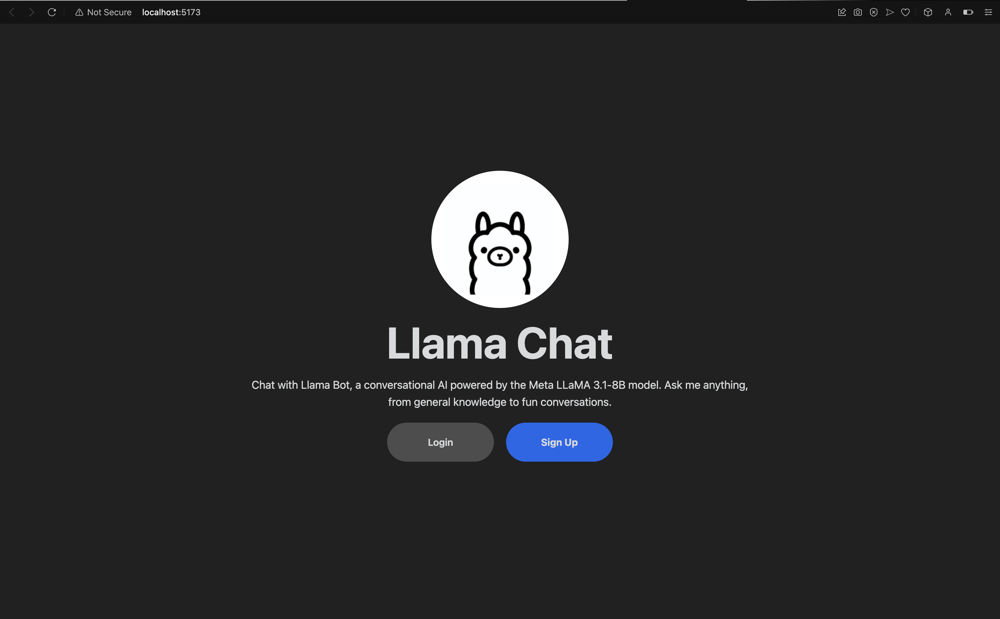
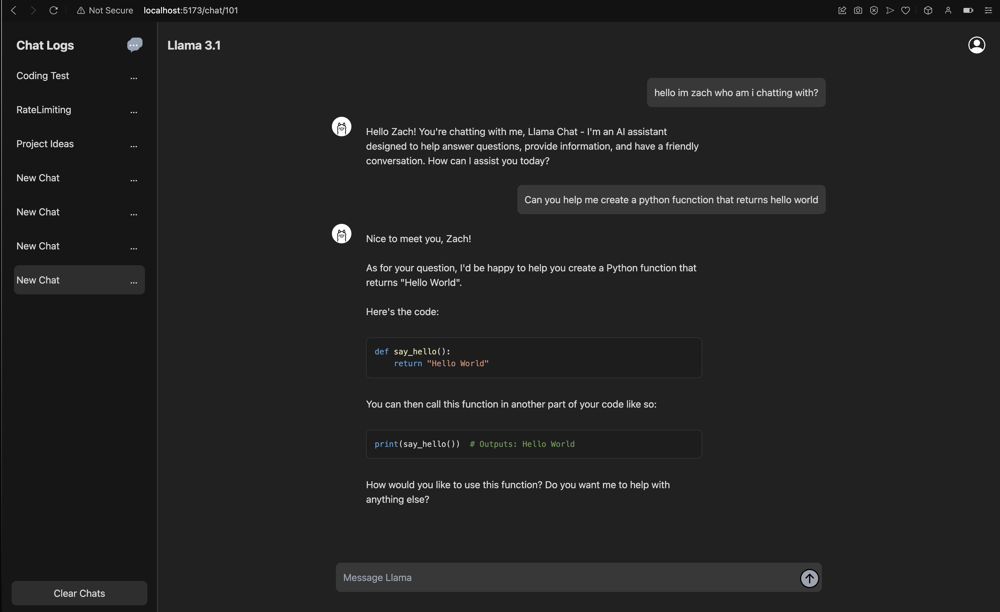

# Llama ChatBot Application

This project features a chat interface similar to OpenAI's website, utilizing the Llama 3.1 model for generating responses. It includes a frontend built with React and TypeScript, and a backend developed using Django.

<p align="center">
  
  
</p>

## Project Structure

- **Frontend**: Located in the `frontend` directory. [Frontend README](./frontend/README.md)
- **Backend**: Located in the `backend` directory. [Backend README](./backend/llama_chatbot/README.md)

## Features

- Real-time chat interface with a modern design.
- Integration with the Llama 3.1 model for chat responses.
- Ability to create new chat threads and manage existing ones.
- User registration and login functionality for personalized experiences.

## Installation

1. **Navigate to the Frontend Directory:**
   ```sh
   cd frontend
   ```

2. **Install Frontend Dependencies:**
   Make sure you have all necessary dependencies installed for the frontend. Run:
   ```sh
   npm install
   ```

3. **Navigate to the Backend Directory:**
   ```sh
   cd ../backend/llama_chatbot
   ```

4. **Install Backend Dependencies:**
   Install the necessary Python packages for the backend. Run:
   ```sh
   pip install -r requirements.txt
   ```

5. **Navigate Back to the Frontend Directory:**
   ```sh
   cd ../../frontend
   ```

## Usage

1. **Start the Application:**
   Use the following command to start both the backend server and the frontend development server, and open the frontend application in your browser:
   ```sh
   npm start
   ```

2. **Interact with the Chat Interface:**
   Once the servers are running, your default web browser will open with the frontend application. You can now register/login and interact with the chat interface.

## License

This project is licensed under the MIT License. See [LICENSE](LICENSE) for details.